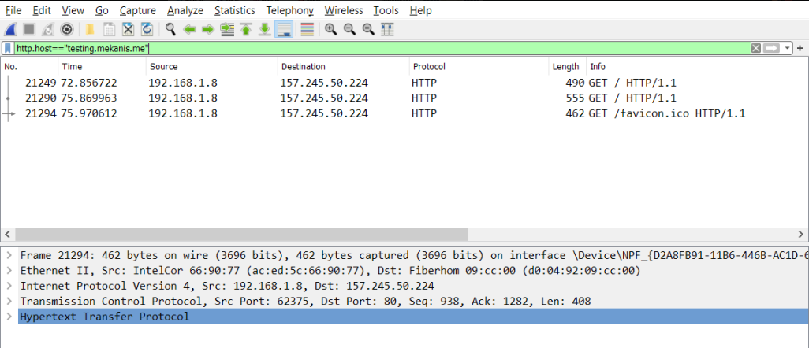
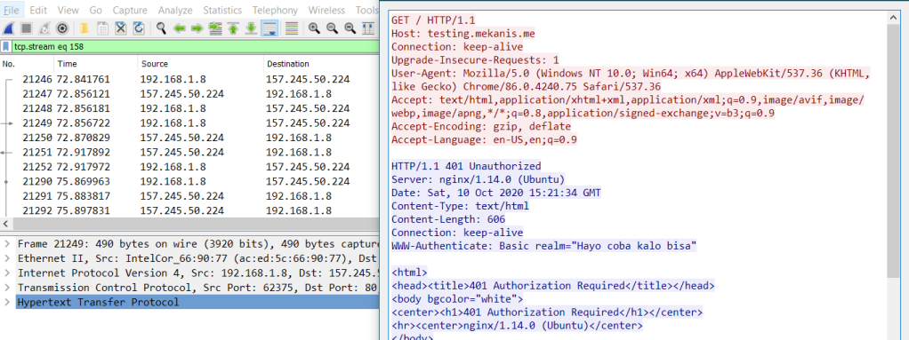
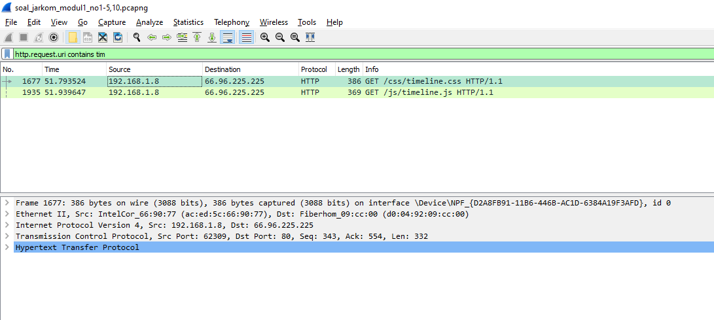
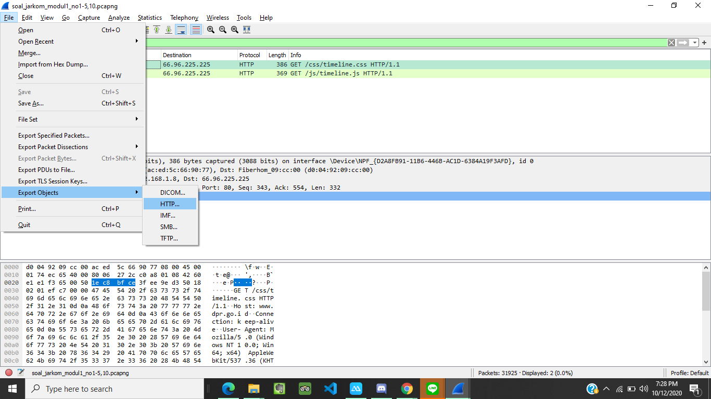
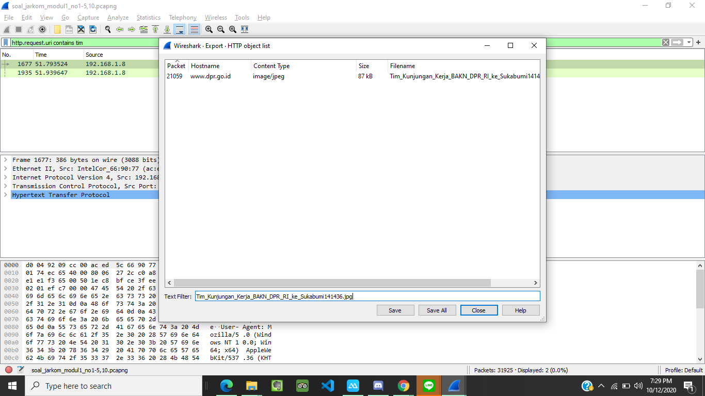

# Lapres Modul 1 Jarkom T17 2020

## Oleh:
- Milenia Ulwan Zafira (0511174000020)
- Bayu Trianayasa (05311840000038)

## Soal
### A.	Display Filter
1.	Sebutkan webserver yang digunakan pada "testing.mekanis.me"!
2.	Simpan gambar "Tim_Kunjungan_Kerja_BAKN_DPR_RI_ke_Sukabumi141436.jpg"!
3.	Cari username dan password ketika login di "ppid.dpr.go.id"!
4.	Temukan paket dari web-web yang menggunakan basic authentication method!
5.	Ikuti perintah di aku.pengen.pw! Username dan password bisa didapatkan dari file .pcapng!
6.	Seseorang menyimpan file zip melalui FTP dengan nama "Answer.zip". Simpan dan Buka file "Open This.pdf" di Answer.zip. Untuk mendapatkan password zipnya, temukan dalam file zipkey.txt (passwordnya adalah isi dari file txt tersebut).
7.	Ada 500 file zip yang disimpan ke FTP Server dengan nama 1.zip, 2.zip, ..., 500.zip. Salah satunya berisi pdf yang berisi puisi. Simpan dan Buka file pdf tersebut.
Your Super Mega Ultra Rare Hint = nama pdf-nya "Yes.pdf"
8.	Cari objek apa saja yang didownload (RETR) dari koneksi FTP dengan Microsoft FTP Service!
9.	Cari username dan password ketika login FTP pada localhost!
10.	Cari file .pdf di wireshark lalu download dan buka file tersebut!
clue: "25 50 44 46" 

### B. Capture Filter
11.	Filter sehingga wireshark hanya mengambil paket yang mengandung port 21!
12.	Filter sehingga wireshark hanya mengambil paket yang berasal dari port 80!
13.	Filter sehingga wireshark hanya menampilkan paket yang menuju port 443!
14.	Filter sehingga wireshark hanya mengambil paket yang berasal dari ip kalian!
15.	Filter sehingga wireshark hanya mengambil paket yang tujuannya ke monta.if.its.ac.id!

## Jawaban
1. menggunakan filter:
```
http.host == testing.mekanis.me
```


lalu Follow TCP Stream <br/>


2. menggunakan filter:
```
http.request.uri contains tim
```


Lalu File -> Export Object -> HTTP, jika terdapat banyak file bisa di cari dibagian search dengan keyword nama file lalu save




3. Gunakan filter:
```
http.host=="ppid.dpr.go.id" && http.request.uri == POST
```
![ss no 3]...

4. Gunakan filter :
```
http.authbasic
```
![ss no 4_1]...
Lalu didapatkan 2 web dengan auth basic
![ss no 4_2]...
![ss no 4_3]...

5. 
